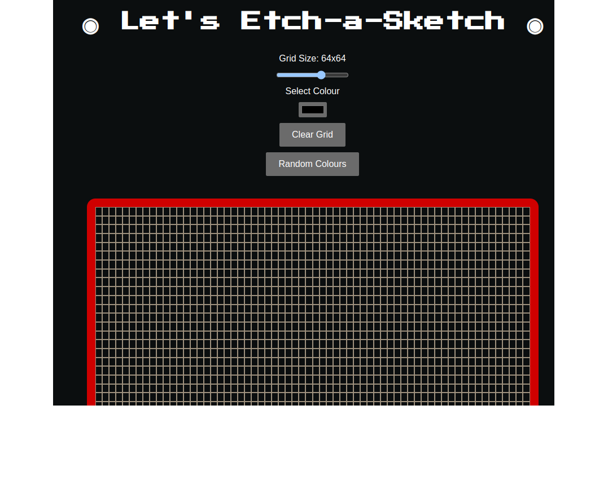

Welcome to Etch-a Sketch! 🎨 This is your go-to tool for creating vibrant, dynamic grids that can brighten up any screen. Whether you're looking to explore a sea of random colours or create a custom colour grid, this tool has you covered!

Visit a live version here: https://opuslearning.github.io/Etch-a-Sketch/
How to Use
1. Grid Size
    • Adjust the Grid Size: Use the grid size slider to set the dimensions of your grid. The grid is square, so moving the slider to 64 means you'll have a 64x64 grid, totalling 4,096 squares of colour fun!
2. Random Colours
    • Generate Random Colours: Click the "Random Colours" button to fill the grid with a dazzling array of random colours. Each square will change its colour when you hover over it, thanks to the magical getRandomColor() function.
3. Custom Colours
    • Pick a Custom Colour: Select a colour using the colour picker. The grid will update to reflect your chosen colour, and every square will take on that hue as you hover over it.
    • See Your Selected Colours: Every time you pick a new colour, a dot appears under the grid, showing off your choices in all their glory.
4. Clear the Grid
    • Start Fresh: If you want a clean slate, simply hit the "Clear Grid" button. This will remove all the squares from the grid and clear out your selected colours.
Features
Dynamic Colour Generation
    • The getRandomColor() function is the star of the show here. It generates random hex colour codes by combining six random characters from the string "0123456789ABCDEF". The result? A grid full of unique and vibrant colours every time!
Customisable Grid
    • You can adjust the size of the grid to fit your needs. Want something small and simple? Set it to a smaller number. Feeling ambitious? Crank it up and enjoy the visual feast of a larger grid.
Interactive and Fun
    • Every square in the grid is interactive. Hover over a square to see it change to a random colour or your selected colour, making every movement a splash of creativity.
Technical Details
    • JavaScript: This tool uses vanilla JavaScript to handle DOM manipulation, event listeners, and dynamic content updates.
    • HTML/CSS: The grid is styled using CSS, with flexbox for layout and grid for the dynamic grid structure.
    • Colour Handling: The getRandomColor() function and the colour picker allow for both random and custom colour generation, giving users full control over their grid's appearance.
Screenshot

Ready to Create?
Now that you know the basics, it's time to get started! Adjust the grid size, pick your colours, and let your creativity run wild. Enjoy making beautiful, colourful grids that you can tweak and play with endlessly!
Happy colouring! 🌈

